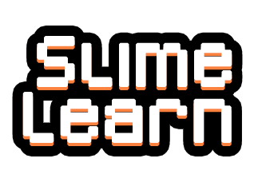
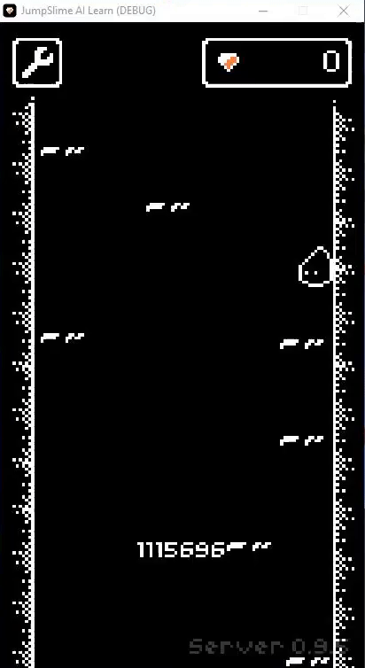

SlimeLearn Framework
=============

<div align="center" >
    
</div>

Toolkit for developing and comparing reinforcement learning algorithms in a simple 2D platformer game enviroment.

SlimeLearn is an AI training framework that uses [JumpSlime!](https://fenixdev.itch.io/jump-slime) as enviroment. This project was made
with the intention of providing a setup for learning about reinforcement learning and other forms of artificial inteligence in
an interesting way. 

<br>
<div align="center" >
    
</div>
<br>

Installation
----------

**Windows**

Download the lastest release [here](https://github.com/javierburgosv/slimelearn/releases/tag/v1.0), extract the files and run slimelearn.exe

**Other**

SlimeLearn does not have builds for other platforms at the moment. But you can still download the source code and run it through Godot Engine.
You can also export it to the platform of choice. Be aware that this process may need some coding and troubleshoting in order to make everything work.

Download the source code by clicking on Code > Download Zip on the top right, or just clone it using git:

```
git clone https://github.com/javierburgosv/slimelearn.git
```

How to use
----------
SlimeLearn requires you to craft some short of agent or code that sends the instructions to the framework in order to play. This comunication
must be stablished through **websocket**. 

When running slimelearn.exe, the enviroment will fire up and a local server will open on the 8080 port. There are two ways of handeling the comunications:

### **The Easy Way**
Using [slimelearn.py](https://github.com/javierburgosv/slimelearn.py) wrapper for Python. This makes really easy to connect, configure
and subscribe to the framework. You will only need to worry about the AI part. Code examples can be found [here](https://github.com/javierburgosv/slimelearn.py/tree/main/examples).

### **The Hard Way**
Handeling the comunications with the enviroment yourself. For this you need to follow this steps:

1. Connect to the server.
2. Send the configuration you want.
3. Listen to the events.

The instructions have to be in form of strings, in json format with some specific fields. You can learn how to construct this requests in the next segment.

For reference, check out the [slimelearn.py source code](https://github.com/javierburgosv/slimelearn.py/blob/main/slimelearnpy/slimelearn.py). 

Requests
----------
Requests have this format:
```JSON
{
    "req": "<instruction_name>",
    "payload": {
        "<argument>": "<argument_value>"
    }
}
```

### Configuration Request
This request stablish the configuration parameters for the server, including the event mode that SlimeLearn will follow to send the enviroment status (every jump, second or frame).

**Mandatory arguments:**
- Mode: This field stablish the type of event that SlimeLearn will follow to send out the enviroment data. It can have one of this values:
    - jump: The status will be sent everytime the player touches the ground. 
    - sec: Every time a set ammount of seconds passes. We can set this value by including the "delay" argument inside the "payload".
    - frame: Once per frame.

**Optional arguments:**
- speed: Multiply the normal speed of the enviroment in order to make trainings faster. Increasing this number may affect the results of the training due to issues with the physics engine. Keep the value under 3.4 for better results.
- replay_path: Sets a route to generate a replay file. This json file contains some context data of the session and the secuential order of actions taken by the player.

**Example**

```JSON
{
    "req": "config",
    "payload": {
        "mode": "sec",
        "delay": 2,
        "replay_path": "C:\\Replays",
    }
}
```

### Jumping Request
To play the game, your AI will need to send the jump action to the game. This can be done in two different ways.

**Basic Jump**

```JSON
{
    "req": "jump"
}
```
When this action is sent, the player will jump inmidietly (as soon as recived). This mimics the way a normal player would play, by looking at the arrow indicator and jumping in the precise moment it points in the desired direction.

**Angle Jump**
```JSON
{
    "req": "jump",
    "payload": {
        "angle": 12.2
    }
}
```
This request tells the player to jump in an specific angle. If the angle is 0, the player will jump completly vertical. 

### Reset Request
This action helps the agent restart the position of the player to the starting point. The configuration, time elapsed and other systems are not influenced by this petition.

```JSON
{
    "req": "reset"
}
```

Responses
----------
Server responses have this format:
```JSON
{
    "responseType": "<key_word>",
    "code": "<response_code>",
    "data": {
        "message": "<context message>"
    }
}
```

### Status Responses
This type of message is sent by the server as a response to some requests. This serve as a control measure to see if the comunications are taking place correctly.

**OK Response**
```JSON
{
    "responseType": "OK",
    "code": 200,
    "data": {
        "message": "Request Successful"
    }
}
```
Sent if the last request was recived as expected.

**FAILURE Response**
```JSON
{
    "responseType": "FAILURE",
    "code": 400,
    "data": {
        "message": "<error message>"
    }
}
```
Sent if something went wrong. It usualy includes a context message with some extra information about the error.

### Data Output
The server send this packages following the mode set in the configuration criteria. They contain output data, precisely all the information related to the enviroment (player possition, distance to the walls, etc). 

**Data**

Contains the following sections:
- player: Player object with basic information.
- sight: List of entitie objects with their basic information (such as platforms).
- limits: Object with the distance between the player and the walls of the map.
- money: Number of gems collected.
- screen: Matrix that contains a binary representation of the screen (117x208px).

**Example**
```JSON
{
    "responseType": "OUTPUT",
    "code": 200,
    "data": {
        "player": {
            "state": "idle",
            "x": 0,
            "y": 0,
        },
        "sight": [
            {
                "name": "",
                "x": 0,
                "y": 0,
            },
        ],
        "limits": {
            "right": 0,
            "left": 0,
        },
        "money": 0,
        "screen": []
    }
}
```
